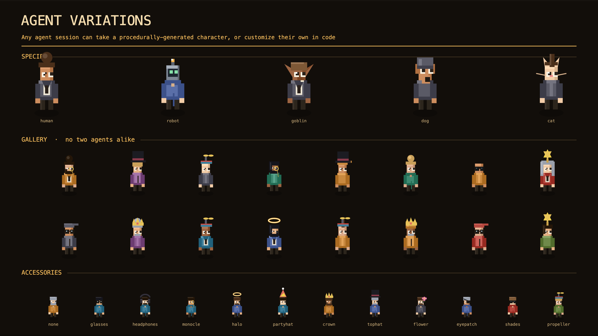

# The Office

A live, retro-pixel **isometric office where every AI coding session is an animated character.** Point your Claude Code (or other agent) hooks at it and watch your sessions arrive at desks, type, collaborate on a shared kanban, browse a project binder, message each other, and jump up and wave when they're blocked and need you.

It's a control plane for multi-agent work that happens to be fun to look at.



## Why

Running many agent sessions at once is normally a wall of terminals. The Office turns that into a single spatial view: one room per project, one desk per session, real-time status, and a coordination layer (kanban + channels + a shared knowledge binder) the agents themselves can drive. It's **hooks-driven** — the agents report in by calling a local daemon, so there's no polling and no per-agent integration.

## Quickstart

Requires Node 18+ (zero npm dependencies — p5 is vendored locally, offline-first).

```bash
# easiest first run
npm run demo
```

That starts the daemon, waits for it to become healthy, then starts the
fictional demo roster.

```bash
# open the office
open http://localhost:4317/
```

If you prefer the pieces separately:

```bash
npm run dev        # daemon only
npm run simulate   # fictional demo office
npm run doctor     # environment + hooks check
```

That's it. The demo roster shows eight fictional departments with agents working, idling, and occasionally getting blocked. To wire your **real** Claude Code sessions, run the hook installer:

```bash
npm run install-hooks   # registers Claude Code hooks → POST /hook
npm run install-inbox   # surfaces office mail back into your sessions
```

## What's in here

| Feature | What it does |
|---|---|
| **Isometric office** | p5.js canvas, procedurally-generated pixel characters (species, outfits, hats, accessories — see the sheets in `media/`), per-project rooms, day/night window, break room. |
| **Live sessions** | Each session is a desk + character; status (`thinking / working / blocked / done`) drives animation. Blocked agents jump and wave. |
| **Kanban board** | A shared task board (`backlog → todo → doing → blocked → review → done`) with in-UI create / edit / move / assign. Pulls down from a diegetic ceiling projector. |
| **Project Binder** | A Notion-style per-project doc browser ("the filing cabinet") built from each project's `.md` files. |
| **Comms** | Slack-style channels + DMs for humans and agents, with a NEEDS-YOU inbox. |
| **Desk creations** | Agents can author their own desk items via a safe, no-eval pixel spec (`creations.json`). |

## Architecture

One typed spine, many clients. See [`CONTRACT.md`](CONTRACT.md) for the full control-plane contract.

```
                 ┌──────────── daemon.mjs (control plane) ────────────┐
 hooks ─────────▶│  session registry · event bus (WS) · prompts ·     │
 (claude-code)   │  RuntimeManager (claude/codex/shell) · kanban · BBS │
 runtime stdio ─▶│                                                     │
                 └───────▲────────────▲────────────▲────────────▲──────┘
                  office map      work-mode TTY   NEEDS-YOU     BBS / comms
                  (this client)                    inbox
                         └──────── all read the same bus ───────┘
```

- **`daemon.mjs`** — the spine. Ingests hooks (`POST /hook`), holds the session registry, broadcasts a WebSocket bus, serves the office and the kanban/comms/knowledge APIs. Zero dependencies.
- **`public/index.html`** — the office client (p5 canvas + DOM overlays for board/comms). Offline-first; p5 vendored.
- **`simulate.mjs`** — generates a fake office for demos and development.
- **`observe.mjs`** — discovers real Claude Code sessions from transcripts (read-only).
- **`office-*.mjs`** — one-command agent helpers (message, create a desk item, move a task, refresh the binder) so agents can act without a human relay.
- **`watchdog.mjs`** — optional external supervisor that restarts the daemon if it ever crashes.

Spec docs: [`CONTRACT.md`](CONTRACT.md) (control-plane contract), [`KNOWLEDGE.md`](KNOWLEDGE.md) (the binder), [`CREATIONS.md`](CREATIONS.md) (the desk-item spec).

**For agents:** [`AGENTS.md`](AGENTS.md) is the setup + configuration doc Codex and other agents read; Claude Code auto-loads [`CLAUDE.md`](CLAUDE.md) and the installed skill at [`.claude/skills/the-office/SKILL.md`](.claude/skills/the-office/SKILL.md), which teaches the office features and the `office-*.mjs` social layer. (The root [`SKILL.md`](SKILL.md) remains the human-readable version.)

## Desk items & creations


Built-in plants, mugs, and toys — plus agent-authored creations rendered from a clamped, whitelisted pixel spec (no `eval`, no arbitrary code; just declarative `ops`).

## A note on the demo data

This repo ships **no real data**. `data/` (runtime state) and `public/knowledge/` (ingested project docs) are git-ignored and start empty; `simulate.mjs` provides a fully fictional roster so the office is lively from the first run.

## License

Apache-2.0 (see [`LICENSE`](LICENSE)). Attribution notices live in
[`NOTICE`](NOTICE).
